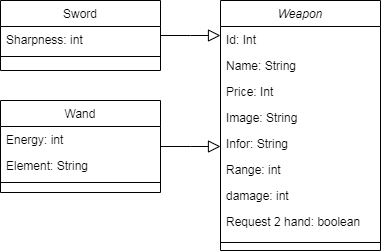

# Display item

## Diagram

## Class 

| Type Class | Name | Description |
| ------------ | ------ | ---------------------- |
| Abstract | Weapon | Super Class, hold normal request |
| DTO | Wand,Sword | Value Class |
| DAO | Wand,Sword | Connect Database Class |
| BUS | Wand,Sword | Controll |
| DAO | DAO | Connect database with 2 type Sword and Wand |
| BUS | BUS | Controll 2 types in 1 classs |
| Java | Test | Test about display item |
| JFrame | GUI | Show item |

## Connect to database

These are 2 type of connect database in this project
 
<ul>
  <li> DTO -> DAO -> BUS without Abstract class, it separate 2 class DAO and BUS
  <li> DTO -> DAO -> BUS with Abstract class, it only 1 DAO and BUS, it's more useful than the other
</ul>
