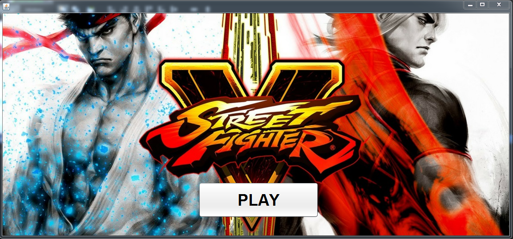

 # Making easy game java

## About
I makeing a easy game OneTwoThree, in this project i used :
<ul>
  <li>Music</li>
  <li>Thread</li>
  <li>Easy logic</li>
</ul>  

And new Sound libery: [playsound.jar](./../lib)  
You can run [.exe file](./../../Run%20app/OneTwoThree) for game  
## Class 

| Type Class | Name | Description |
| ------------ | ------ | ---------------------- |
| GUI | Home | Home and setting thing |
| GUI | GUI | PLay game |
| Java | RunnableDemo | Thread |

