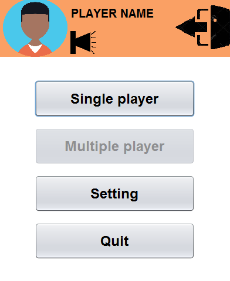

 # Making easy game java

## About
I makeing a easy game TicTacToe, in this project i used :
<ul>
  <li>Music</li>
  <li>Easy logic</li>
  <li>Connect LAN</li>
</ul>  

And new Sound libery: [playsound.jar](./../lib)  
You can run [.exe file](./../../Run%20app/TicTacToe) for game  
## Class 

| Type Class | Name | Description |
| ------------ | ------ | ---------------------- |
| GUI | Home | Home and setting thing, watting for player |
| GUI | Game | PLay game |
| GUI | Mult_Player | Find your friend for duel |
| GUI | Setting | Setting your information and display |
| Java | Memory | Save your process |
| Java | RunnableDemo | Thread |

